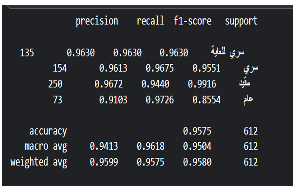

# Transactions Sensitivity Classification (Emirate of Makkah)

## Project Overview

This project showcases a custom Arabic document classification pipeline designed for Emirate of Makkah transactions. The main goal is to classify documents into different sensitivity levels ("Top Secret", "Secret", "Restricted", "Public") specially for future documents containing unseen terms beyond the training set using advanced AI techniques.

---

## Motivation

Traditional text classification approaches often rely only on the raw text content. In this project, I wanted to push beyond that by integrating **administrative metadata** (the column "الإدارة") to help the model capture organizational context, which is crucial in government and sensitive data settings.

---

## Pipeline Highlights

- **Custom text preprocessing**: Combined multiple descriptive columns (such as key identifiers, data types, process descriptions) into a unified input field with a special `[SEC]` token for better guidance to the model.

- **Admin metadata integration**: One-hot encoded the "الإدارة" (admin department) column and incorporated it into the model architecture, allowing the network to learn additional patterns beyond text alone.

- **Customized AraBERT architecture**: 
  - Used AraBERT (aubmindlab/bert-base-arabertv02) as a backbone.
  - Integrated admin features through a dedicated feed-forward network layer.
  - Combined CLS embeddings, mean-pooled embeddings, and admin features into a unified final classification layer.

- **Balanced focal loss**: Applied a custom-balanced focal loss to handle class imbalance and improve performance, especially for rare sensitivity classes.

- **Data augmentation**: Used oversampling for minority classes to further improve generalization.

- **Early stopping and weighted metrics**: Adopted early stopping and custom evaluation metrics focusing on weighted F1 score to ensure robust model performance.

---

## Results

The model achieved high accuracy and strong class-wise F1 scores, demonstrating its capability to handle sensitive document classification tasks.

<p align="center">
  
</p>

<p align="center">
  
</p>

---

## Project Pipeline

A detailed step-by-step pipeline diagram is included in [Project pipeline PDF](Project%20pipline.pdf).  

---

## Files

- `Transactions_Sensitivity_Classification.ipynb`: Complete notebook containing all code, data preparation, and training steps.
- `Accuracy.png`, `examplr use.png`: Visual results and example usage.
- `Project pipline.pdf`: Diagram outlining the full workflow and architecture.
- `README.md`: This description file.

---

## How to Use

### Installation

```bash
pip install torch torchvision torchaudio transformers datasets accelerate peft evaluate scikit-learn sentencepiece
